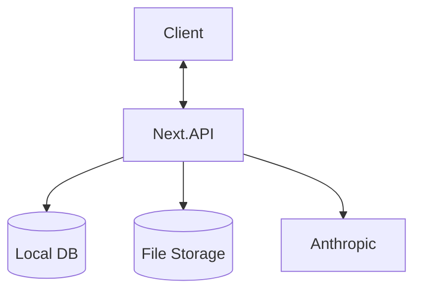
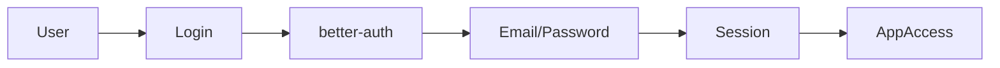
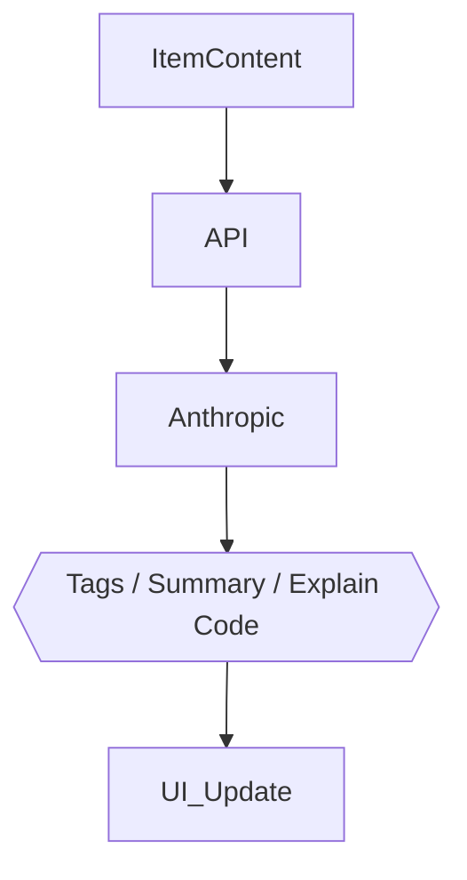

## DevStash Project Specifications

🚀 Centralized Developer Knowledge Hub

---

## DevStash Project Specifications

🚀 **Centralized Developer Knowledge Hub** for code snippets, AI prompts, docs, commands & more.

---

## 📌 Problem (Core Idea)

Developers keep their essentials scattered:

- Code snippets in VS Code or Notion
- AI prompts in chats
- Context files buried in projects
- Useful links in bookmarks
- Docs in random folders
- Commands in .txt files
- Project templates in GitHub gists
- Terminal commands in bash history

This creates **context switching, lost knowledge** and **inconsistent workflows**.

➡️ **DevStash provides ONE searchable, AI‑enhanced hub for all dev knowledge & resources.**

---

## 🧑‍💻 Users

| Persona                    | Needs                                     |
| -------------------------- | ----------------------------------------- |
| Everyday Developer         | Quick access to snippets, commands, links |
| AI‑First Developer         | Store prompts, workflows, contexts        |
| Content Creator / Educator | Save course notes, reusable code          |
| Full‑Stack Builder         | Patterns, boilerplates, API references    |

---

## ✨ Core Features

### A) Items & System Item Types

Items can belong to one of the following built‑in types:

- Snippet
- Prompt
- Note
- Command
- File
- Image
- URL

Custom types allowed.

### B) Collections

Organize items—mixed item types allowed.

Examples:

- React Patterns
- Context Files
- Python Snippets

### C) Search

Full‑text search using Postgres `to_tsvector` across:

- Content
- Tags
- Titles
- Types

### D) Authentication

- Email + Password

### E) Additional Features

- Favorites & pinned items
- Recently used (localStorage)
- Import from files
- CodeMirror 6 for code-type items, TipTap for notes
- Shiki for syntax highlighting in display views
- One-click copy to clipboard on all items
- Keyboard shortcuts: Cmd+K command palette, Cmd+N new item
- File uploads (images, docs, templates)
- Export (JSON / Markdown)
- Dark mode (default)

### F) AI Superpowers

- Auto‑tagging
- AI summaries
- Explain Code
- Prompt optimization

> AI powered by **Anthropic claude haiku**

---

## 🗄️ Data Model (Rough Draft — using Drizzle, schema syntax for reference only)

> This schema is a starting point and **will evolve**

```prisma
model User {
  id          String       @id @default(cuid())
  email       String       @unique
  password    String?
  items       Item[]
  itemTypes   ItemType[]
  collections Collection[]
  tags        Tag[]
  createdAt   DateTime     @default(now())
  updatedAt   DateTime     @updatedAt
}

model Item {
  id          String   @id @default(cuid())
  title       String
  contentType String   // text | file
  content     String?  // used for text types
  fileUrl     String?
  fileName    String?
  fileSize    Int?
  url         String?
  description String?
  isFavorite  Boolean  @default(false)
  isPinned    Boolean  @default(false)
  language    String?

  userId      String
  user        User @relation(fields: [userId], references: [id])

  typeId      String
  type        ItemType @relation(fields: [typeId], references: [id])

  collections ItemCollection[]
  tags        ItemTag[]

  createdAt   DateTime @default(now())
  updatedAt   DateTime @updatedAt
}

model ItemType {
  id       String   @id @default(cuid())
  name     String
  icon     String?
  color    String?
  isSystem Boolean  @default(false)

  userId   String?
  user     User? @relation(fields: [userId], references: [id])

  items    Item[]
}

model Collection {
  id          String   @id @default(cuid())
  name        String
  description String?
  isFavorite  Boolean  @default(false)

  userId      String
  user        User @relation(fields: [userId], references: [id])

  items       ItemCollection[]
  createdAt   DateTime @default(now())
  updatedAt   DateTime @updatedAt
}

model ItemCollection {
  itemId       String
  collectionId String
  addedAt      DateTime @default(now())

  item         Item       @relation(fields: [itemId], references: [id])
  collection   Collection @relation(fields: [collectionId], references: [id])

  @@id([itemId, collectionId])
}

model Tag {
  id     String @id @default(cuid())
  name   String
  userId String
  user   User @relation(fields: [userId], references: [id])

  items  ItemTag[]
}

model ItemTag {
  itemId String
  tagId  String

  item Item @relation(fields: [itemId], references: [id])
  tag  Tag  @relation(fields: [tagId], references: [id])

  @@id([itemId, tagId])
}
```

---

## 🧱 Tech Stack

| Category     | Choice                       |
| ------------ | ---------------------------- |
| Framework    | **Next.js (React 19)**       |
| Language     | TypeScript                   |
| Database     | PostgreSQL (Dokploy) + Drizzle ORM |
| File Storage | Cloudflare R2                |
| CSS/UI       | Tailwind CSS v4 + ShadCN     |
| Auth         | better-auth (email/password) |
| AI           | Anthropic Claude Haiku       |
| Deployment   | Dokploy (self-hosted)        |

---

## 🎨 UI / UX

- Dark mode first
- Minimal, developer‑friendly UI
- Syntax highlighting for code
- Inspired by **Notion, Linear, Raycast**

### Layout

- **Collapsible sidebar** with filters & collections
- Main grid/list workspace
- Full‑screen item editor

### Responsive

- Mobile drawer for sidebar
- Touch‑optimized icons and buttons

---

## 🔌 API Architecture



---

## 🔐 Auth Flow



---

## 🧠 AI Feature Flow



---

## 🧭 Roadmap

### **MVP**

- Items CRUD
- Collections
- Search
- Basic tags

### **Phase 2**

- AI features
- Custom item types
- File uploads
- Export

### **Future Enhancements**

- Shared collections
- Team/Org plans
- VS Code extension
- Browser extension
- API + CLI tool

---

## 📌 Status

- In planning
- Ready for environment setup & UI scaffolding

---

🏗️ **DevStash — Store Smarter. Build Faster.**
